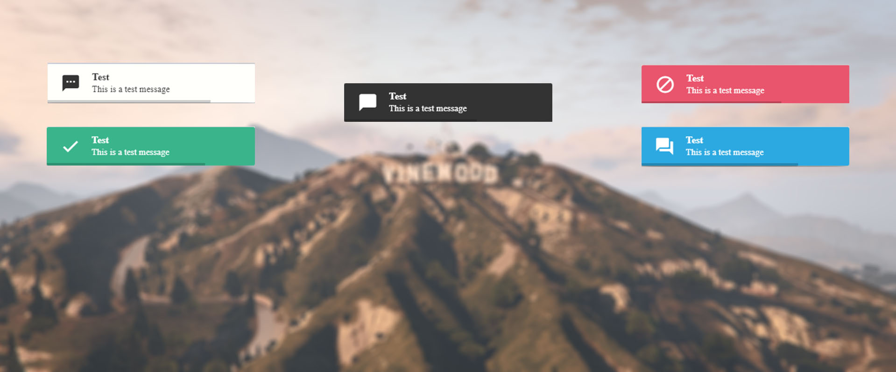
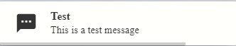

<div align='center'></div>
<div align='center'><h3><a href="https://discord.gg/RsWzxwtAY3">Discord</a></h3></div>

# rr_notify | Simple notifications

### Important

**DISCONTINUED** This resource is considered to be discontinued. Everything works fine and is perfectly useable. But this resource will not be updated anymore since it has been replaced by:
[RR UILib](https://github.com/RoleplayRevisited/rr_uilib)

## Notification Types

**text**  


**log**  


**info**  


**success**  


**error**  


## Usage

There are two ways to trigger a notification. Either by triggering a client event. or using exports
As you can see in the event and export you need to add an argument. This argument is an object containing all the data
See below how to use it

**Client Event**

```lua
TriggerClientEvent("rr_notify:notifyC", source, props)
```

**Exports**

```lua
exports.rr_notify:notify(props)
```

## Props

</br>

**Message**

```lua
Required = true
Default = nil

-- Example
props = {
  msg = "This is a test message"
}
```

**Style**

```lua
Required = false
Default = "text"

Options = {
  "text", "log", "info", "success", "error"
  }

-- Example
props = {
  style = "text"
}
```

**Title**

```lua
Required = false
Default = props.style -- Uses the name of the tyle of the message. So for error style the title would be error

-- Example
props = {
  title = "Test Title"
}
```

**Duration**

```lua
Required = false
Default = 5000 -- 5 seconds | Time in MS

-- Example
props = {
  duration = 1000
}
```

**Position**

```lua
Required = false
Default = "tr" -- Top Right

Options = {
  "tr", -- Top Right
  "tm", -- Top Middle
  "tl", -- Top Left
  "mr", -- Middle Right
  "mn", -- Middle Middle
  "ml", -- Middle Left
  "br", -- Bottom Right
  "bm", -- Bottom Middle
  "bl", -- Bottom Left
}

-- Example
props = {
  position = "tm"
}
```

**Progress**

```lua
Required = false
Default = true -- Shows a progress bar

-- Example
props = {
  progress = false
}
```

**Animate**

```lua
Required = false
Default = "fade"

Options = {
  "fade", "slide"
}

-- Example
props = {
  animate = "slide"
}
```

## Example Usage

```lua
  local props = {
    msg = "This is a test message",
    title = "This is a test title",
    duration = 6000,
    progress = false,
    animate = "slide",
    position = "mm",
  }

  exports.rr_notify:notify(props)
```

If you have any further questions please join my <a href="https://discord.gg/RsWzxwtAY3">Discord</a>. So that I can help you

## Legal

# License

MIT License
rr_notify
Copyright (c) 2022 RoleplayRevisited

Permission is hereby granted, free of charge, to any person obtaining a copy
of this software and associated documentation files (the "Software"), to deal
in the Software without restriction, including without limitation the rights
to use, copy, modify, merge, publish, distribute, sublicense, and/or sell
copies of the Software, and to permit persons to whom the Software is
furnished to do so, subject to the following conditions:

The above copyright notice and this permission notice shall be included in all
copies or substantial portions of the Software.

THE SOFTWARE IS PROVIDED "AS IS", WITHOUT WARRANTY OF ANY KIND, EXPRESS OR
IMPLIED, INCLUDING BUT NOT LIMITED TO THE WARRANTIES OF MERCHANTABILITY,
FITNESS FOR A PARTICULAR PURPOSE AND NONINFRINGEMENT. IN NO EVENT SHALL THE
AUTHORS OR COPYRIGHT HOLDERS BE LIABLE FOR ANY CLAIM, DAMAGES OR OTHER
LIABILITY, WHETHER IN AN ACTION OF CONTRACT, TORT OR OTHERWISE, ARISING FROM,
OUT OF OR IN CONNECTION WITH THE SOFTWARE OR THE USE OR OTHER DEALINGS IN THE
SOFTWARE.
